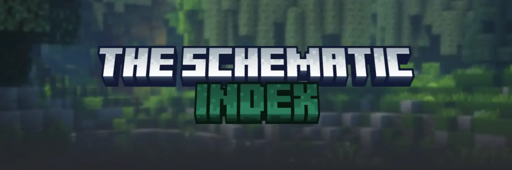
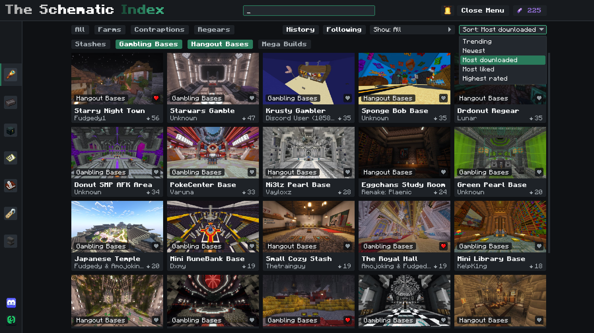
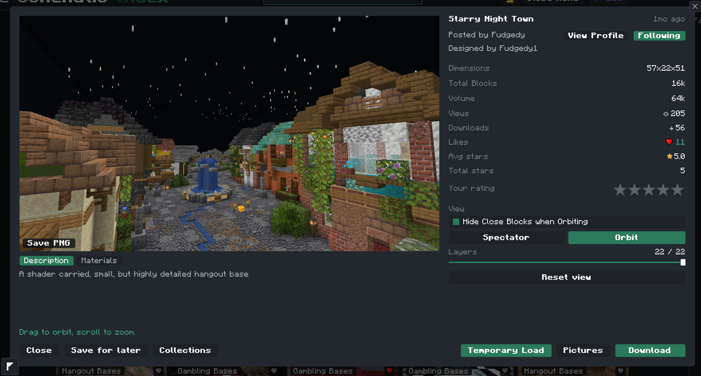
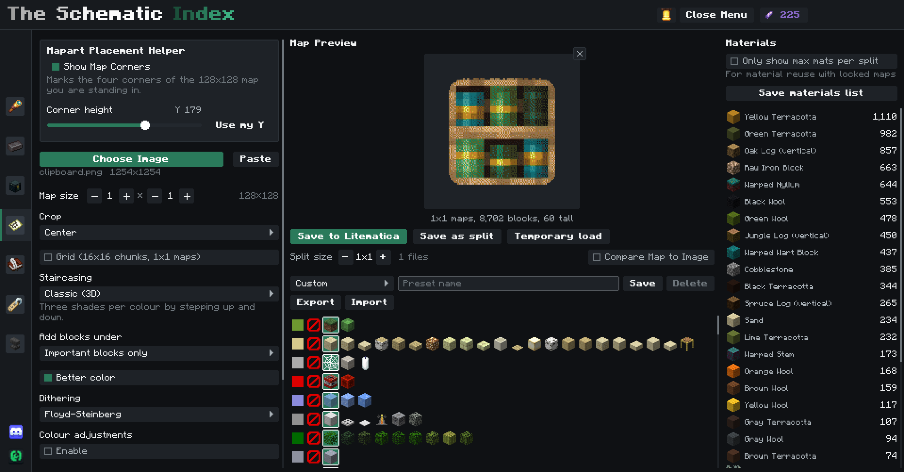
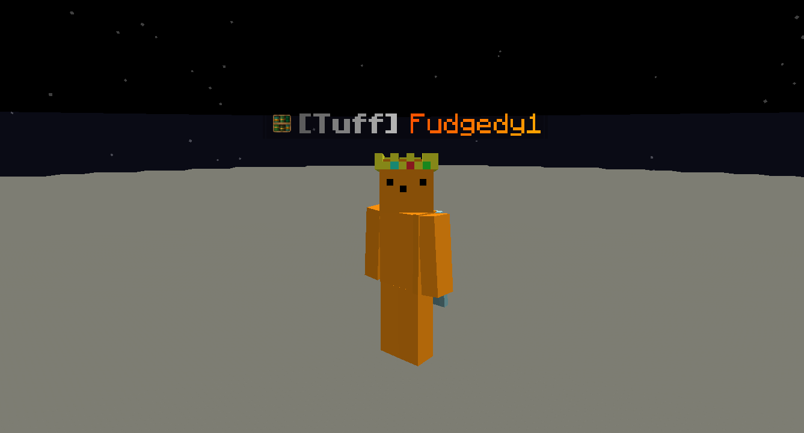
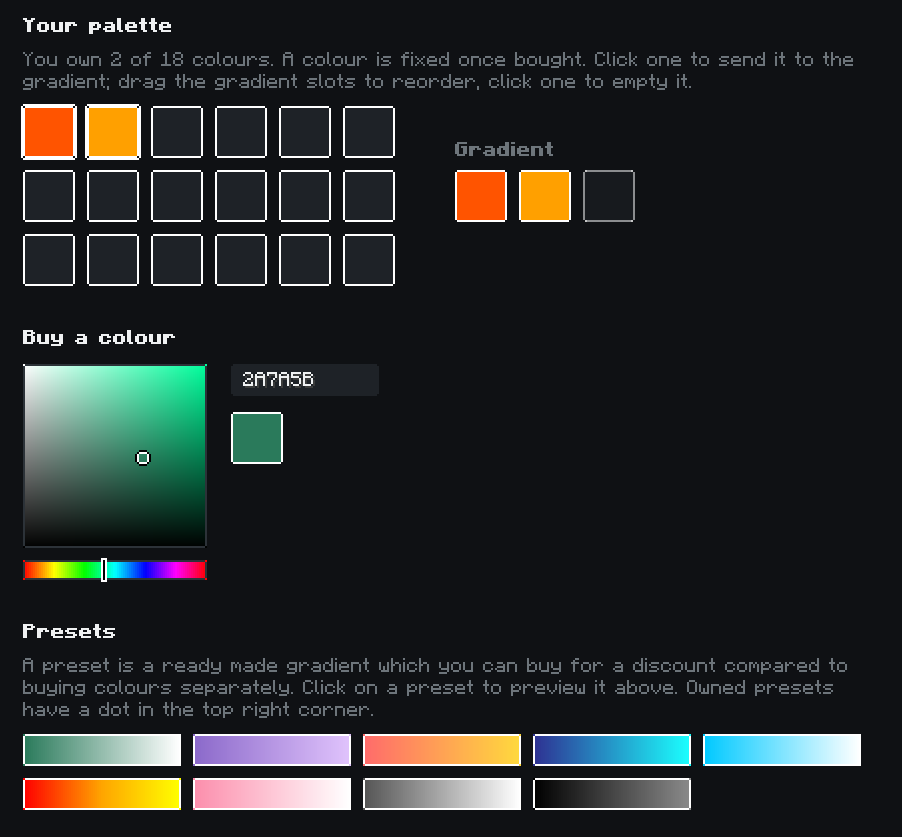
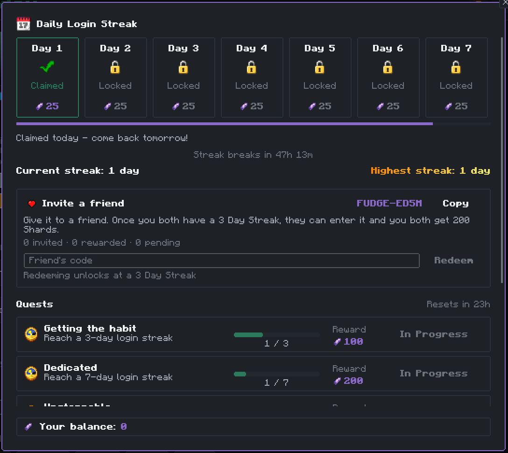
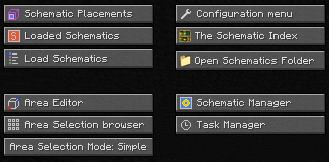

<p align="center">
  
</p>

<p align="center">
  <a href="https://modrinth.com/mod/the-schematic-index"></a>
  <a href="https://discord.gg/schematicindex"></a>
  <a href="https://modrinth.com/mod/the-schematic-index/versions"></a>
  <a href="LICENSE"></a>
</p>

<p align="center">
  <a href="https://modrinth.com/mod/the-schematic-index"><b>Download on Modrinth</b></a> ·
  <a href="https://discord.gg/schematicindex"><b>Join the Discord</b></a> ·
  <a href="#building-from-source"><b>Build from source</b></a>
</p>

---

The Schematic Index is a Fabric client mod that puts a community schematic catalogue inside Minecraft.
Browse builds in a post-like grid, inspect them in a 3D preview, and download them straight into
[Litematica](https://modrinth.com/mod/litematica) , all without ever exiting minecraft. It also turns images into
mapart schematics ( Flat + Staircased ), and gives everyone running the mod a small nametag badge with cosmetics to unlock.

<p align="center">
  
</p>

## Features

### Catalogue
- Categories, tags, search and sorting (trending, newest, most downloaded, most liked, highest rated).
- Likes, star ratings, collections, a history tab and a following feed with a notification when a
  creator you follow posts something new.
- Every download lands in the schematics folder of the running client, or a folder you pick.
- Right-click a post for quick actions, or download a whole collection in one go.

### 3D preview
Orbit and zoom around a build, or use spectator mode to inspect it as if you were actually in spectator mode in minecraft. Cut away layers with the slider,
hide close blocks while orbiting, save a PNG of the view, and read the full material list before you
download.

<p align="center">
  
</p>

### Mapart
Pick or paste an image and get a Litematica schematic back: every map colour, classic and flat
staircasing, dithering, colour adjustments, editable block palettes with import and export, split
file saves for larger maps, per-map material lists, an in game corner overlay for placing the mapart correctly, and a temporary in-world load to check it before downloading.

<p align="center">
  
</p>

### Nametag cosmetics
Everyone running the mod gets a small badge next to their name, visible to other users on the same
server. Colours, gradients, tags and effects are unlocked with Shards, the in-mod currency earned
through a daily streak, weekly quests and inviting friends.

<p align="center">
  
  
</p>

<p align="center">
  
</p>

## Installation

1. Install [Fabric Loader](https://fabricmc.net/use/) for your Minecraft version.
2. Drop [Litematica](https://modrinth.com/mod/litematica) and [MaLiLib](https://modrinth.com/mod/malilib)
   into your `mods` folder.
3. Download The Schematic Index from [Modrinth](https://modrinth.com/mod/the-schematic-index) and add it too.
4. Launch the game. The catalogue opens from Litematica's main menu (`M` by default) or with its own
   key under Options > Controls > Schematic Index.

<p align="center">
  
</p>

The catalogue itself is served by a hosted backend that is not part of this repository.

## Supported versions

| Folder | Minecraft | Java | MaLiLib | Litematica |
|---|---|---|---|---|
| `26.2/` | 26.2 | 25 | 0.29.3 | 0.28.4 |
| `26.1/` | 26.1.2 | 25 | 0.28.11 | 0.27.12 |
| `1.21.11/` | 1.21.11 | 21 | 0.27.16 | 0.26.12 |

`26.2/` is the source of truth. The other two folders are ports of it that differ only where the
Minecraft API changed; a change lands in `26.2/` first and is carried across with the same edit.

## Building from source

Each version folder is a standalone Gradle project.

```sh
cd 26.2
./gradlew build
```

The jar is written to `build/libs/`. Gradle downloads a matching JDK through the toolchain resolver
if the one on your `PATH` is too old; to point at one explicitly, set `JAVA_HOME` first
(Java 25 for `26.2` and `26.1`, Java 21 for `1.21.11`).

To run a development client with the mod loaded:

```sh
./gradlew runClient
```

## Contributing

Bug reports and pull requests are more than welcome. For anything larger than a small fix, open an issue or say
hello in a support ticket in the [Discord](https://discord.gg/schematicindex) first, so that the work is not copied. Make your change in `26.2/` and, where the same code exists, apply it to `26.1/` and `1.21.11/` as well.

If you have found a security issue within the mod or server side, I kindly ask that you please report it privately through Discord rather than a public issue, use the same support ticket system.

## Licence

[MIT](LICENSE) © Fudgedy
